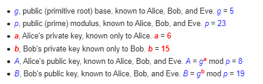

<a name="readme-top"></a>

## Getting started
The Diffie-Hellman key exchange is one of the earliest algorithms used to securely exchange cryptographic keys over a public channel . It allows encrypted communication between two parties that have no prior knowledge of each other to jointly establish a shared secret key over an insecure channel.

## Secrecy chart : 




## Code organization: 
```sh
.
├── README.md
├── Cargo.toml
├── src
│   ├── main
├── images
│   ├── secrecy_chart.PNG
```

The code runs with Rust / Cargo . For the moment, only unit tests are available 

a) To run the tests
```sh
cargo test
```

b) To run the test for big primes
```sh
cargo test --features big-primes
```

## References :

https://www.geeksforgeeks.org/implementation-diffie-hellman-algorithm/


<p align="right">(<a href="#readme-top">back to top</a>)</p>
